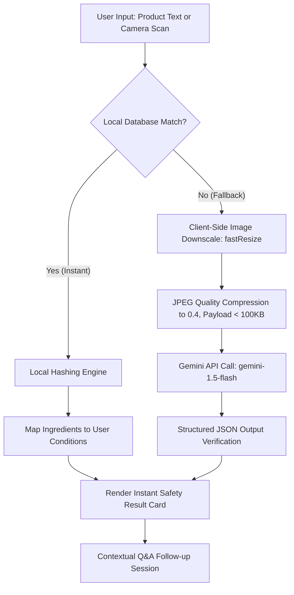

# SafeScan (세이프스캔) Core Application 🛡️📱

The core engine of **SafeScan**—a real-time, privacy-first health safety assistant that extracts product ingredients using device vision and translates complex biochemistry into tailored risk summaries based on a user's chronic conditions.

Developed with a focus on **utility-first design** and **latency minimization**, SafeScan is built to serve as a fast, reliable community utility for active retail environments.

---

## 🏗️ System Architecture & Workflow

SafeScan uses a **Hybrid Offline-Cloud Architecture** that prioritizes local search for zero-latency lookups, falling back to Google's Gemini Vision API only when a scanned product is not present in the local database.



---

## 🛠️ Engineering Highlights & Optimizations

### 1. Hybrid Offline-First Hashing Engine
* **Local Database Indexing (`src/services/localDb.ts`):** Implements a lightweight, local relational dictionary of common household products, ingredients, and condition-specific hazard rules.
* **Synonym Expansion Mapping:** The engine automatically expands and maps user-declared conditions (e.g., matching "dairy allergy" against synonyms like "lactose intolerance", "유제품 알레르기", "우유") to perform deterministic offline checks.
* **API Quota Protection:** By handling known products locally, SafeScan reduces unnecessary cloud roundtrips, eliminates cold starts, and prevents API token exhaustion under high concurrent usage.

### 2. Client-Side "Diet" Latency Pipeline
* **Canvas-Based Downscaling (`fastResize`):** Resizes raw mobile camera images (typically 3–8 MB) to a maximum dimension of `512px` before upload. This preserves text legibility for ingredient lists while stripping redundant pixels.
* **JPEG Compression Tuning:** Compresses image quality to `0.4` before base64 transmission, reducing payload size to **under 100 KB** (a **98% reduction** in network payload).
* **Model Selection:** Integrates `gemini-1.5-flash`, reducing overall end-to-end vision latency from **30 seconds to under 3 seconds** (a **90% latency reduction**).

### 3. Resource Lifecycle & Memory Guardrails
* **Object URL Revocation:** When capturing or uploading images, React generates object URLs using `URL.createObjectURL(file)`. SafeScan implements an active `useEffect` cleanup hook in `src/App.tsx` to revoke these URLs (`URL.revokeObjectURL(url)`) as soon as the image changes or the scan resets.
* **Leak Prevention:** This optimization prevents the browser from leaking memory by caching garbage-collected image assets during extended scanning sessions.

### 4. Structured AI Outputs & Zero-Hallucination Guardrails
* **Strict Schema Enforcement:** Leverages the `@google/genai` SDK to force the model to respond strictly in a predefined JSON structure:
  ```typescript
  interface AnalysisResult {
    level: 'SAFE' | 'CAUTION' | 'DANGER';
    summary: string;
    details: string;
    ingredients: string[];
  }
  ```
* **The Grounding Protocol:** The system prompt forces the model to cite authoritative public databases—such as the **World Health Organization (WHO), Food and Drug Administration (FDA), and Ministry of Food and Drug Safety (MFDS)**—in the `details` field to eliminate standard AI hallucinations.

### 5. Rollup Asset Splitting & Caching Strategy
* **Manual Chunking (`vite.config.ts`):** Configures Rollup to split the monolithic bundler output into separate, cacheable vendor files:
  * `index.js` (Core Application Logic — ~50 KB)
  * `genai.js` (Google Gen AI SDK — ~284 KB)
  * `motion.js` (Framer Motion — ~124 KB)
  * `vendor.js` (React core library — ~198 KB)
* **Optimization Benefit:** By splitting the bundle, browser clients only re-download the core application logic (~50 KB) when updates are pushed, while caching large libraries indefinitely.

---

## 📂 Project Structure

```
safe-scan-app/
├── src/
│   ├── components/
│   │   ├── ProfileSetup.tsx       # User chronic conditions setup
│   │   ├── Scanner.tsx            # Camera capture & text input interface
│   │   ├── ResultCard.tsx         # Safety report card & follow-up chat
│   │   └── LoadingSpinner.tsx     # Animated camera scanning feedback
│   ├── services/
│   │   ├── analyzer.ts            # Hashing engine, fastResize, & Gemini API client
│   │   └── localDb.ts             # Local offline database dictionary
│   ├── App.tsx                    # Main app state & memory lifecycle management
│   ├── main.tsx                   # React root entry point
│   ├── index.css                  # Tailwind CSS styling tokens
│   ├── translations.ts            # Bilingual localization dictionary
│   └── types.ts                   # TypeScript interfaces
├── vite.config.ts                 # Dev server, define fallbacks, & manual Rollup splitting
├── package.json                   # Dependency manager (Pruned of backend modules)
└── README.md                      # Systems documentation
```

---

## 💻 Tech Stack

* **Frontend Framework:** React 19 + TypeScript + Vite 6
* **Inference Client:** `@google/genai` (V3 Google Gen AI SDK)
* **Design & Animations:** Tailwind CSS v4 + Framer Motion (glassmorphic theme tokens)
* **Deployment Engine:** Cloudflare Pages (Static Edge CDN hosting)

---

## 🚀 Development Setup

### Prerequisites
* Node.js (v18 or higher)
* A Google Gemini API Key (Optional — local matching is active by default)

### Installation

1. **Clone repository:**
   ```bash
   git clone https://github.com/angdulu/safe-scan-app.git
   cd safe-scan-app
   ```

2. **Install dependencies:**
   ```bash
   npm install
   ```

3. **Configure Environment Variables (Optional):**
   Create a `.env` file in the root directory to activate the Gemini fallback:
   ```env
   GEMINI_API_KEY="your_gemini_api_key"
   ```

4. **Launch development server:**
   ```bash
   npm run dev
   ```

---
*Created by Andrew Kim.*
